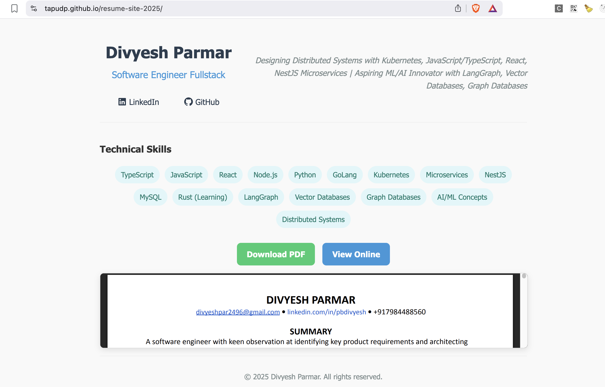

# Divyesh Parmar - Professional Resume Website




A responsive, SEO-optimized resume website with integrated PDF viewer. Hosted on GitHub Pages.

## Features
- 📄 PDF resume viewer with download option
- 📱 Fully responsive design (mobile/desktop)
- 🔍 SEO-optimized with meta tags
- ⚡ Fast static site (HTML/CSS/JS only)
- 🔄 Auto-deploys via GitHub Pages

## File Structure
```
resume-website
├── index.html # Main website content
├── styles.css # All styling
├── script.js # Interactive elements
├── resume.pdf # Your resume (replace to update)
├── social-preview.jpg # Social media preview image
└── README.md # This file
```

## How to Update Content

### 1. Updating Your Resume PDF
1. Replace `resume.pdf` with your new file
2. Keep the filename **exactly** `resume.pdf` (case-sensitive)
3. Commit and push changes:
   ```bash
   git add resume.pdf
   git commit -m "Update resume PDF"
   git push

### 2. Updating Website Content
- Edit these files as needed:
- index.html → Change text, metadata, or structure
- styles.css → Modify styling
- script.js → Update interactive elements

3. Changing Social Preview Image
- Replace social-preview.jpg (1200×630 pixels recommended)
- Update the meta tags in index.html:
```
<meta property="og:image" content="%PUBLIC_URL%/social-preview.jpg">
<meta property="twitter:image" content="%PUBLIC_URL%/social-preview.jpg">
```

## Deployment
- This site automatically deploys via GitHub Pages:
- Pushed changes to main branch → Auto-deploys within 2 mins
- Live site: https://tapudp.github.io/resume-site-2025/

### Manual Deployment Check
- Go to: Repository → Settings → Pages
- Verify: "GitHub Pages is building your site"
- Wait for green checkmark: "Your site is published at..."

### Development
- To test locally:
    - Open index.html in browser
    - For PDF testing, use VS Code Live Server extension